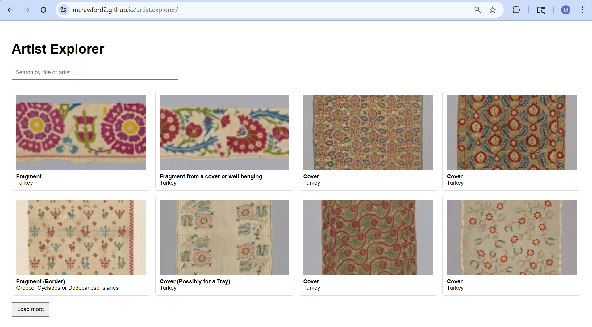

# What your app does
Artist Explorer lets users view and search artwork digitally from the Art Institute of Chicago. The app loads artworks in pages of 8, and displays each one as a card with a thumbnail image, title, and artist name. Users can also search or specify results by typing in the search bar. Clicking any card will open a larger panel with the image and additional information, including date, origin, medium, dimensions, department, and how it got to the Institute.

# Which API you used (with link)
Art Institute of Chicago - https://api.artic.edu 
- GET /api/v1/artworks - fetches paginated artwork cards (id, title, artist, image)
- GET /api/v1/artworks/{id} - fetches full details for a selected artwork

# Link to live site
https://mcrawford2.github.io/artist.explorer/  

# Screenshot

# What you learned about working with APIs
Working with APIs was not as intimidating as I originally believed it to be. Doing so taught me how to retrieve and use external data in a web application. I learned how to make requests with fetch, async, and await, handle responses by parsing JSON, and manage error states when requests fail. I also learned to use the fields parameter to request only the data the app actually needs, and to handle pagination by tracking the current page and total pages from the API response, for instances such as managing the "Load more" button.